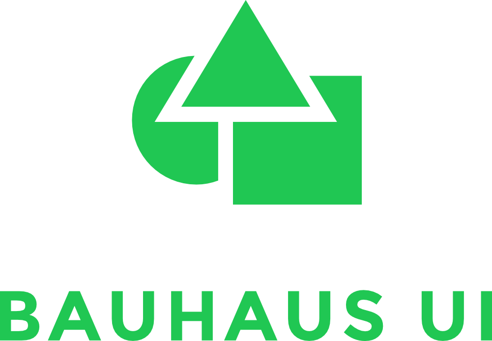
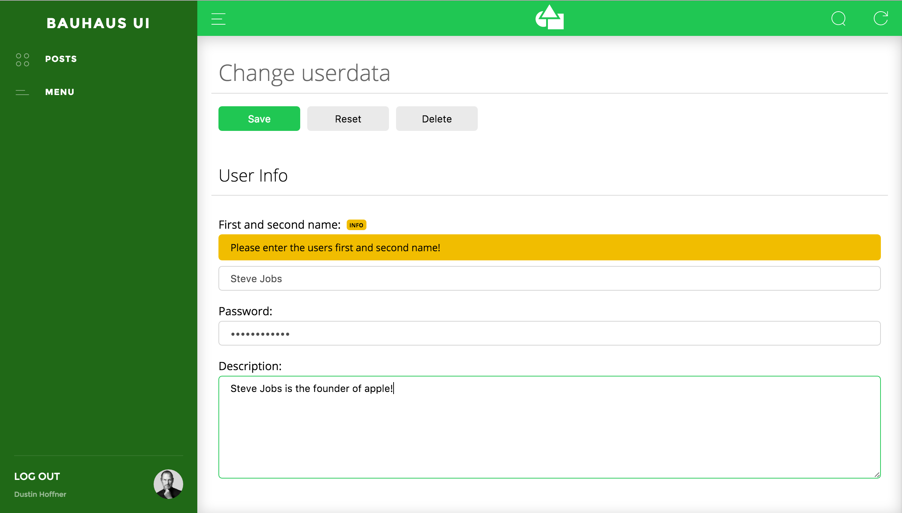

Customizable & API-Driven UI Framework based on [React](https://github.com/facebook/react)

[Docs](docs/README.md) - [Get Started](docs/GetStarted.md) - [Example](docs/Example.md)

 

## Features

- **API-Driven:**   
Everything can be controlled by an individual REST-API endpoint. No need to code any client side code!
- **Extensible and Customizable:**  
You can use [core-modules](docs/coreModules) like the [JSON Form Generator](docs/coreModules/form/JsonForm.md) or create own UI-modules/components.

**Other Features:**
- Responsive
- I18n Support
- Token- and Cookie-based authorisation
- Search
- Sidebar
- [Form Generator](docs/coreModules/form/JsonForm.md)
  - Input (Text, Number, Password, Rich-Text, Checkbox, Textarea, Select, Date+Time, Files)
  - Validation
  - Sections
  - Hints
  - Conditional forms

## Contribute
We actively welcome pull requests.

## License
Bauhaus-UI is [MIT](LICENSE) licensed.

Created with ♥ by Dustin Hoffner.
