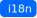

# Module: Validator
This module defines a validation for a JsonForm path. It renders the `failMessage` if `regex` did not match and a required message when the path is `undefined` and `required === true`.

## Props:

Name                                                                                                      | Info
--------------------------------------------------------------------------------------------------------- | ---------------------------------------------------------------------------------
path                                                                                                      | The JsonForm data-object-path
required <br/>***(Optional)***                                                                            | Boolean defines wether the path is required to be set or not (`false` by default)
regex <br/>***(Optional)***                                                                               | String including a regular expression
failMessage <br/>***(Optional)*** <a href="../../i18n.md"></a> | String including a message which is shown when the regex does not match

## Example:

```js
{
   name: 'Validator',
   props: {
      path: 'hello.world.test',
      required: true,
      regex: 'abc',
      failMessage: 'This needs to include "abc"!'
   }
}
```

## I18n: <a href="../../i18n.md"></a>

id   | english text
---- | -----------------------------
core.commons.errors.required | Required!
